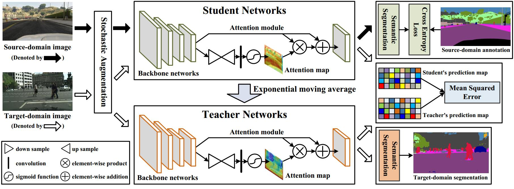

# Self-Ensembling Attention Networks: Addressing Domain Shift for Semantic Segmentation

Pytorch implementation of our method for domain adaptation in semantic segmentation task.




## Paper
Self-Ensembling Attention Networks: Addressing Domain Shift for Semantic Segmentation

Please cite our papers if you find it useful for your research.

```
@inproceedings{SEAN,
  title={Self-Ensembling Attention Networks: Addressing Domain Shift for Semantic Segmentation},
  author={Xu, Yonghao and Du, Bo and Zhang, Lefei and Zhang, Qian and Wang, Guoli and Zhang, Liangpei},
  booktitle={Thirty-Third AAAI Conference on Artificial Intelligence},
  year={2019},
}
```

## Installation
* Install `Pytorch 0.4.0` from https://github.com/pytorch/pytorch with `Python 3.6`.

* Clone this repo.
```
git clone https://github.com/YonghaoXu/SEANet
```

## Dataset
* Download the [GTA-5 Dataset](https://download.visinf.tu-darmstadt.de/data/from_games/).

* Download the [SYNTHIA-RAND-CITYSCAPES Dataset](synthia-dataset.net/download/808/).
  - Note: The ground-truth data in the original SYNTHIA-RAND-CITYSCAPES dataset should be adjusted to be consistent with those in the cityscapes dataset. Here we attach the transformed [ground-truth data](https://drive.google.com/open?id=1GvdXSG4nq8Px0xYs3ate0reNNKtci2dS) for the SYNTHIA-RAND-CITYSCAPES dataset.

* Download the [Cityscapes Dataset](https://www.cityscapes-dataset.com/).

## Pretrained Model Utilized in our Experiment
* Download the pretrained [VGG-16 Model](http://drive.google.com/uc?id=0B9P1L--7Wd2vT0FtdThWREhjNkU).

## Training
* Training for GTA-5 to Cityscapes.
  - Change the default path of `--data_dir_source` in `SEAN_GTA5.py` with your GTA-5 dataset folder.
  - Change the default path of `--data_dir_target` in `SEAN_GTA5.py` with your Cityscapes dataset folder.
  - Change the default path of `--restore_from` in `SEAN_GTA5.py` with your pretrained VGG model path.
  - Refer to `dataset/gta5_dataset.py` and `dataset/cityscapes_dataset.py` for further guidance about how the images and ground-truth files are organized.

```
python SEAN_GTA5.py
```

* Training for Synthia to Cityscapes.
  - Change the default path of `--data_dir_source` in `SEAN_Synthia.py` with your Synthia dataset folder.
  - Change the default path of `--data_dir_target` in `SEAN_Synthia.py` with your Cityscapes dataset folder.
  - Change the default path of `--restore_from` in `SEAN_Synthia.py` with your pretrained VGG model path.
  - Refer to `dataset/synthia_dataset.py` and `dataset/cityscapes16_dataset.py` for further guidance about how the images and ground-truth files are organized.

```
python SEAN_Synthia.py
```  

## Evaluation
  - Change the default path of `--data_dir` in `evaluation.py` with your Cityscapes dataset folder.
  - Change the default path of `--restore_from` in `evaluation.py` with your trained model path. You can also download our [GTA-5 to Cityscapes model](https://drive.google.com/open?id=1g-NSAaHxkvru4G0lBNolmcioH8elCoqo) for a look.
  - For evaluation on Synthia to Cityscapes case, please replace the `test_mIoU` function in `evaluation.py` with the 'test_mIoU16' function. Besides, since there are only 16 categories in common, the codes for writing the segmentation maps parts need to be further modified. If you have good implementation for this issue, please pull a request.

```
python evaluation.py
```

## Empirical Observations 
* Following the previous research setting in this task, we check the mIoU value on the target domain after every 500 iterations. A lower frequency for the checking would accelerate the network training, but may also miss the best performance.
* A large `--attention_threshold` would be detrimental to the performance of the framework. Empirically, 0 to 0.3 is a suitable range for this parameter.
